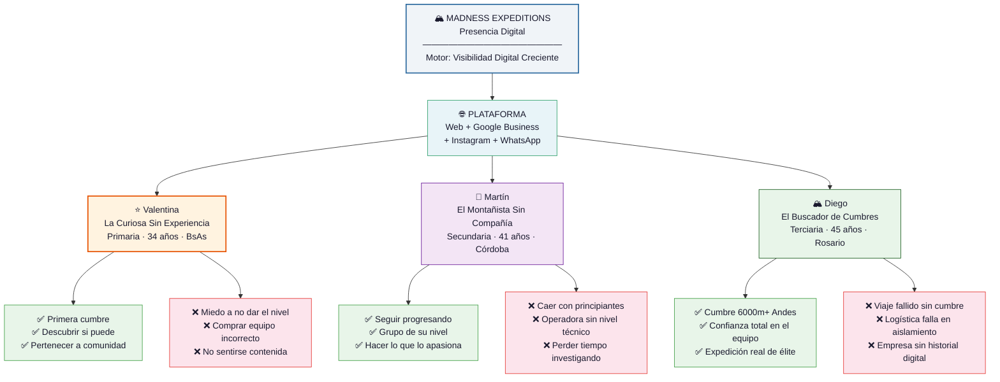

# Trigger Map — Madness Expeditions

> Mapa estratégico que conecta los objetivos de negocio con la psicología de los usuarios

**Proyecto:** Madness Expeditions — Web Institucional y Presencia Digital
**Fase:** 2 — Trigger Mapping
**Creado:** 2026-04-07
**Autor:** Irivadeneira
**Metodología:** Effect Mapping (Balic & Domingues) adaptado por WDS v6
**Estado:** Completo ✅

---

## Visión

> **Madness Expeditions es la operadora de montaña de referencia en Argentina para personas que quieren hacer su primera cumbre o crecer continuamente en la montaña — con el mismo acompañamiento personalizado de Pablo Fortunato, ahora visible y encontrable en el mundo digital.**

---

## Diagrama Estratégico

---

## Resumen Estratégico

### Foco de Diseño

> **La web de Madness Expeditions debe ante todo resolver la desconfianza y el miedo a no encajar de personas que nunca hicieron montaña o que la hacen solos — mostrando de forma honesta y cálida quiénes son Pablo y su equipo, qué nivel se necesita para cada viaje, y que siempre hay acompañamiento real desde antes del primer paso.**

### El Motor

La visibilidad digital es el motor de todo. Sin web no hay tráfico, sin tráfico no hay consultas, sin consultas no hay reservas. El punto de inflexión es simple: existir online para las personas que ya están buscando lo que Madness ofrece.

### El Patrón Transversal

Un miedo aparece en los 3 grupos de captación: **la desconfianza ante una empresa sin historial digital visible**. Para Valentina es "¿me van a cuidar?", para Martín es "¿tienen el nivel técnico?", para Diego es "¿puedo confiarles mi seguridad?". **Una sola raíz, tres manifestaciones.** La credibilidad de Pablo y el equipo debe estar en el centro de la web.

---

## Grupos Objetivo — En Síntesis

| Prioridad | Persona | Rol | Driver Crítico |
|---|---|---|---|
| **#1** | Valentina — La Curiosa Sin Experiencia | Motor de captación y comunidad | Miedo a no dar el nivel / no ser contenida |
| **#2** | Martín — El Montañista Sin Compañía | Motor de conversión rápida | Miedo a caer en grupo de principiantes |
| **#3** | Diego — El Buscador de Cumbres | Alto valor económico | Miedo al viaje fallido sin cumbre |
| **Retención** | Carlos — El Cliente Fiel | Embajador y retención | Miedo a perderse salidas por comunicación caótica |

---

## Objetivos de Negocio — En Síntesis

| Tipo | Objetivo | Métrica |
|---|---|---|
| ⭐ Motor | Visibilidad digital creciente | Tráfico web ascendente mes a mes |
| 🚀 Captación | Consultas calificadas digitales | 10–30 consultas por período de salida |
| 🚀 Conversión | Completar grupos de 5–10 personas | 30–50% conversión consulta → reserva |
| 🚀 Reputación | Reseñas Google auténticas | 15+ reseñas en 6 meses |
| 🌟 Operación | Liberar a Pablo de gestión caótica | <1h semanal de gestión digital en 3 meses |

---

## Documentación Detallada

| Documento | Descripción |
|---|---|
| [01-business-goals.md](./01-business-goals.md) | Visión, objetivos SMART y flywheel estratégico |
| [personas/02-Valentina-la-Curiosa.md](./personas/02-Valentina-la-Curiosa.md) | Persona primaria — perfil completo y promesas de producto |
| [personas/03-Martin-el-Montanista.md](./personas/03-Martin-el-Montanista.md) | Persona secundaria — perfil completo y promesas de producto |
| [personas/04-Diego-el-Buscador.md](./personas/04-Diego-el-Buscador.md) | Persona terciaria — perfil completo y promesas de producto |
| [05-key-insights.md](./05-key-insights.md) | Insights estratégicos e implicaciones de diseño |
| [feature-impact-analysis.md](./feature-impact-analysis.md) | Análisis de impacto de features por persona |

---

## Cómo Leer Este Trigger Map

1. **Empezá por aquí** — Este hub te da la visión completa
2. **Objetivos de negocio** — Qué necesita lograr la web para que el negocio crezca
3. **Personas** — Quiénes son los usuarios reales y qué los mueve (y asusta)
4. **Key Insights** — Qué significa todo esto para el diseño y el desarrollo
5. **Feature Impact** — Qué features construir primero y por qué

**Regla de oro:** Cuando haya que tomar una decisión de diseño, la pregunta es siempre: *"¿Esto reduce el miedo de Valentina o la ayuda a llegar a su primera cumbre?"*

---

*Generado con Whiteport Design Studio v6 — Fase 2: Trigger Mapping*
*Metodología basada en Effect Mapping (Balic & Domingues, inUse)*
*Próxima fase: [Fase 3 — UX Scenarios](../../design-artifacts/C-UX-Scenarios/)*
